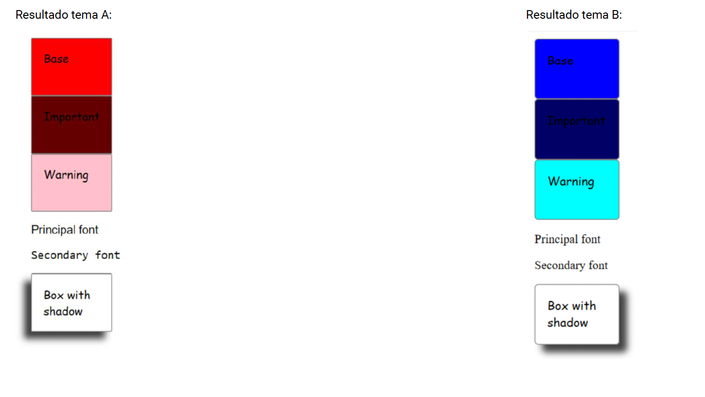

## Ejercicio 2: Crear dos temas distintos y mostrar los resultados en una página.

Los cambios en el tema afectan a las siguientes características:
- Color
- Fuente
- Border Radius 
- Shadow Box

Para visualizar los cambios debería ser suficiente importar un tema u otro en el fichero de estilos principal.

##  Instrucciones

| Instrucción               |                                                                         |
| :------------------------ | :---------------------------------------------------------------------- |
| `npm install`             | Instala las dependencias                                                |
| `npm run dev`             | Inicia el servidor de desarrollo en `http://localhost:5173/`            |
| `npm run build`           | Construye el proyecto en el directorio dist                             |

Para cambiar de tema editar el fichero style.scss. Cambiar @use "themes/theme1.scss" as *; por @use "themes/theme2.scss" as *; y viceversa.
