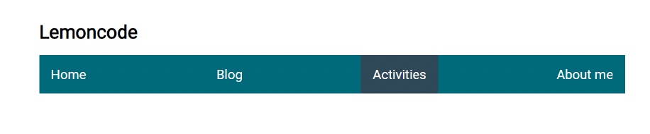
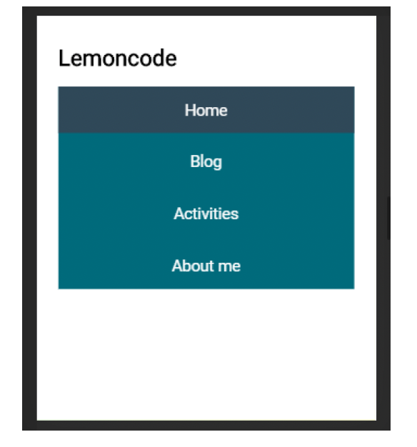

# Ejercicio 3: Crear la barra de navegación de la imagen usando Flexbox.
El html es abierto completamente, es decir crear las estructuras necesarias que secrean convenientes.La barra de navegación responde a distintas resoluciones. Utilizar media queries paraconseguir este resultado.

Resultado resoluciones mayores:

Resultado resoluciones menores:

##  Instrucciones

| Instrucción               |                                                                         |
| :------------------------ | :---------------------------------------------------------------------- |
| `npm install`             | Instala las dependencias                                                |
| `npm run dev`             | Inicia el servidor de desarrollo en `http://localhost:5173/`            |
| `npm run build`           | Construye el proyecto en el directorio dist                             |
