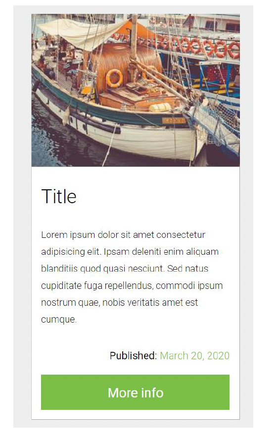

# Ejercicio 4: Crearemos un elemento de tipo card con Grid CSS.

Las alineaciones deberán hacerse con esta característica, pero el html es totalmente abierto.

##  Instrucciones

| Instrucción               |                                                                         |
| :------------------------ | :---------------------------------------------------------------------- |
| `npm install`             | Instala las dependencias                                                |
| `npm run dev`             | Inicia el servidor de desarrollo en `http://localhost:5173/`            |
| `npm run build`           | Construye el proyecto en el directorio dist                             |

